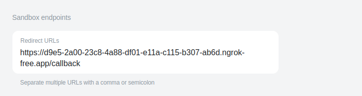

# Openbanking Revolut Payment Initiation flow 

This repository implements Revolut Open Banking Payment Initiation Service Provider (PISP) flow using the Revolut sandbox, following the guide at [Revolut Developer Docs](https://developer.revolut.com/docs/guides/build-banking-apps/tutorials/initiate-your-first-payment).

This is the server implementation that accompanies the [openbanking.nr](https://github.com/openbanking-nr) repository, providing the backend functionality to support the Open Banking circuit implementation and the demo escrow app. 

## Capabilities

- Initiate a payment using the PISP sandbox
- Retrieve signed payment initiation confirmation
- Verify JWS of payment initiation confirmation and payment status 
- Certificate verification (parsing, validation, OCSP status)

## Prerequisites

- Create a Revolut developer account at https://developer.revolut.com/portal/signin

- Follow the revolut guide [here](https://developer.revolut.com/docs/guides/build-banking-apps/get-started/register-your-application-in-the-developer-portal) to obtain: 
    - private.key
    - client_id 
    - transport.pem 
    - jwks url 
    - kid 

- Create a Revolut business sandbox account at https://sandbox-business.revolut.com/signin
(note: at time of writing the personal sandbox account does not have dummy funds to execute payments)


## Setup

1. Clone the repository
2. create a keys folder in the root of the project and add the following files:
    - private.key
    - transport.pem
3. Install dependencies:
    ```
    npm install
    ```  
4. Run ngrok to expose your local server in a seperate terminal. Install ngrok if not already installed:

    ```
    ngrok http 3000
    ```
    tip: run static domain with ngrok by creating ngrok account and obtaining the link from dashboard so you dont have to keep doing step 5 every time you run it. 


5. Copy the Forwarding URL from ngrok, appending "/callback" to the end, and paste it into: 

    a. the Revolut developer portal as the Redirect URL appending "/callback" at end like this:
    
    b. the .env file in this repo

6. create environment file: 
    ```
    cp .env.example .env
    ``` 
7. modify .env file with variables obtained earlier
8. run the server: 
    ```
    node src/server.js
    ```

## Usage 
### Option 1: Scripts 
Use standalone scripts to test and validate the payment flow to simulate the "Frontend" :

1. **payments.js**: Execute the complete payment initiation flow

    ```bash
    cd scripts
    node payments.js
    ```
    This script:
    - Gets an access token
    - Creates a payment consent
    - Generates an authorization URL
    - After user authorization, initiates the payment
    - Saves results to paymentInitResponse.json and paymentConsentResponse.json 


2. **checkPaymentStatus.js**: Verify the status of an initiated payment

    ```bash
    cd scripts
    node checkPaymentStatus.js
    ```
    Note: The sandbox environment payments remain in "Pending" status. To see a "Confirmed" status, you need to manually use the Business API to simulate the state change.

3. **verifyRevolutJws.js**: Verify the JWS signature and certificates

    ```bash
    cd scripts
    node verifyRevolutJws.js
    ```

    This script:
    - Verifies JWS signatures using the crypto library
    - Parses the certificate data
    - Performs certificate validation (both high-level and low-level)
    - Attempts OCSP verification (partial implementation)

### Option 2: Server Implementation

Run the server for integration with frontend applications:

    
    node src/server.js
    

#### Server Endpoints
- **POST /initiate-payment**: Creates a payment consent and returns authorization URL
- **POST /execute-payment**: Completes the payment after user authorization
- **GET /payment-status/:paymentId**: Retrieves current payment status
- **POST /commitment**: Creates a new commitment record
- **GET /commitment/:hash**: Retrieves a commitment by hash
- **GET /commitments**: Lists all commitments
- **DELETE /commitments**: Purges all commitments

#### Commitment Database (for escrow contract commitments)
The server uses a simple SQLite database (commitments.sqlite) to store and track payment commitments. Each commitment record contains:
- Hash: Unique identifier for the commitment
- Amount: Payment amount
- Currency: Payment currency
- Debtor: Sender information
- Creditor: Recipient information
- Timestamp: Creation time


## Project Structure

The project is organized with a focus on modularity and separation of concerns. The `src` directory contains the core server implementation:

### src/ Directory

| File | Description |
| ---- | ----------- |
| **server.js** | Main application entry point. Initializes Express server, sets up routes, and handles HTTPS configuration. |
| **paymentService.js** | Implements the core Open Banking payment functionality, including payment initiation, consent management, and JWS signature generation. |
| **jws.js** | Handles JSON Web Signature (JWS) creation and verification, essential for the Open Banking security protocols. |
| **commitmentDb.js** | Database interface for storing and retrieving payment commitments, using SQLite as the underlying storage. |
| **commitments.sqlite** | SQLite database file that stores payment commitment records. |
| **stateManager.js** | Manages application state, particularly for the OAuth flow and session handling. |
| **callback.js** | Processes callbacks from the Open Banking authorization server after user consent. |
| **callback.html** | HTML template displayed to users after the authorization flow completes. |

### scripts/ Directory

The `scripts` directory contains standalone utilities for testing and verification:
- **payments.js**: Executes the complete payment flow
- **checkPaymentStatus.js**: Verifies payment status
- **verifyRevolutJws.js**: Validates JWS signatures and certificates

### certificates/ Directory

Contains the Open Banking certificates necessary for the trust chain:
- Root CA certificates
- Issuing CA certificates

## Notes 

- [Openbanking.nr explanation](https://hackmd.io/zslMbRQvTFG90p37OSkU2Q)
- [OpenBanking UK Signature Verification Guide](https://openbankinguk.github.io/read-write-api-site3/v4.0/profiles/read-write-data-api-profile.html#process-for-verifying-a-signature)

## License 
This project is licensed under the MIT License. See the LICENSE file for details.

